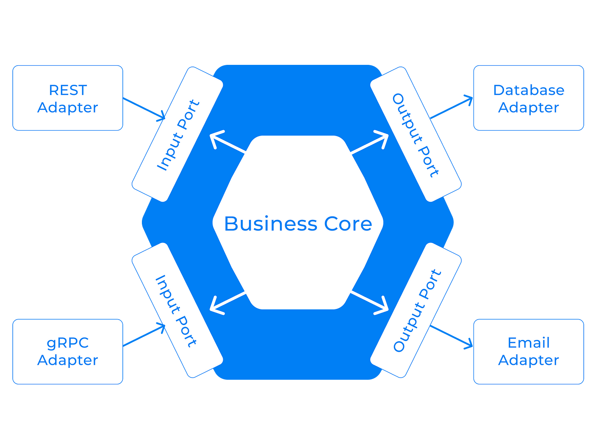

# mini-wallet
Mini Wallet Exercise JULO

## Getting started

### This Project Uses Hexagonal Architecture


### Local Requirements
For required requirements for this projects, you need wire.
#### Wire
Needed for compile dependencies injection.
https://github.com/google/wire

### Local Development
For setup in local development
#### 1. Copy .env
```
cp .env.example .env
```

#### 2. Run using Makefile
```
make local
```

#### 3. Local port
Destination port
```
8782 : Rest
```

### Migration using Makefile
Migration up
```
make migration-up
```